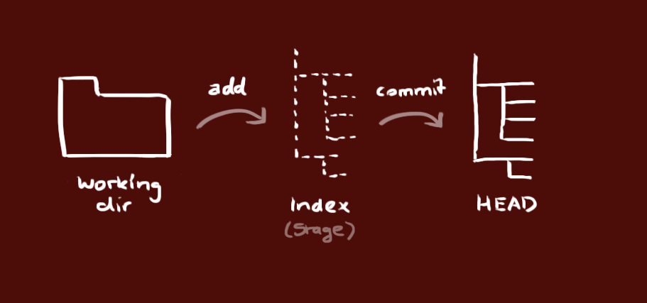

Git
---

###Installation

Git ist eine freie Software zur verteilten Versionsverwaltung und Austausch von Dateien. GitHub, Source Code Control System (SCCS), Apache Subversion, BitKeeper, SourceTree und viele mehr sind Beispiele für eine Git-Software.

* [Windows](http://msysgit.github.io/)
* [OS X](https://code.google.com/p/git-osx-installer/downloads/list?can=3)
* [Linux](http://git-scm.com/book/en%2FGetting-Started-Installing-Git)

###Neues Repository

Erstelle ein neues Verzeichnis, öffne es und führe `git init` aus, um ein neues git-Repository anzulegen.

###Repository auschecken

Erstelle eine Arbeitskopie, indem du folgenden Befehl ausführst: `git clone /pfad/zum/repository`. Falls du ein entferntes Repository verwendest, benutze: `git clone benutzername@host:/pfad/zum/repository`.

###Workflow

Dein lokales Repository besteht aus drei "Instanzen", die von git verwaltet werden. Die erste ist deine `Arbeitskopie`, welche die echten Dateien enthält. Die zweite ist der `Index`, welcher als Zwischenstufe agiert und zu guter Letzt noch der `HEAD`, der auf deinen letzten Commit zeigt.

###Add und Commit

Du kannst Änderungen vorschlagen (zum Index hinzufügen) mit `git add <dateiname>` oder `git add .`.
Das ist der erste Schritt im git workflow, du bestätigst deine Änderungen mit:
`git commit -m "Commit-Nachricht"`.
Jetzt befindet sich die Änderung im HEAD, aber noch nicht im entfernten Repository.

###Änderung hochladen

Die Änderungen sind jetzt im HEAD deines lokalen Repositories. Um die Änderungen an dein entferntes Repository zu senden, führe:
`git push origin master`
aus. Du kannst master auch mit einem beliebigen anderen Branch ersetzen, mehr über Branches erfährst du später.

Wenn du dein lokales Repository nicht von einem entfernten geklont hast und du diese aber mit einem anderen Repository verbinden möchtest, musst du dieses mit
`git remote add origin <server>`.
hinzufügen.

###Branching

Branches werden benutzt, um verschiedene Funktionen isoliert voneinander zu entwickeln. Der master-Branch ist der "Standard"-Branch, wenn du ein neues Repository erstellst. Du solltest aber für die Entwicklung andere Branches verwenden und diese dann in den Master-Branch zusammenführen (mergen).

Erstelle einen neuen Branch mit dem Namen "feature_x" und wechsle zu diesem:
`git checkout -b feature_x`.

Um zum Master zurück zu wechseln:
`git checkout master`.

Und um den eben erstellten Branch wieder zu löschen:
`git branch -d feature_x`.

Ein Branch ist nicht für andere verfügbar, bis du diesen in dein entferntes Repository hochlädst:
`git push origin <branch>`.

###Upadate und Merge

Um dein lokales Repository mit den neuesten Änderungen zu aktualisieren, verwende:
`git pull`.
in deiner Arbeitskopie, um die Änderungen erst herunterzuladen (fetch) und dann mit deinem Stand zusammenzuführen (merge).
Wenn du einen anderen Branch mit deinem aktuellen (z.B. master) zusammenführen willst, benutze:
`git merge <branch>`.
In beiden Fällen versucht git die Änderungen automatisch zusammenzuführen. Unglücklicherweise ist dies nicht immer möglich und endet in Konflikten. Du bist verantwortlich, diese Konflikte durch manuelles Editieren der betroffenen Dateien zu lösen. Bist du damit fertig, musst du das git mit folgendem Befehl mitteilen:
`git add <dateiname>`.
Bevor du Änderungen zusammenführst, kannst du dir die Differenzen auch anschauen:
`git diff <quell_branch> <ziel_branch>`.

###Änderungen rückgängig machen

Falls du mal etwas falsch machst, kannst du die lokalen Änderungen mit:
`git checkout -- <filename>`.
auf den letzten Stand im HEAD zurücksetzen. Änderungen, die du bereits zum Index hinzugefügt hast, bleiben bestehen.

Wenn du aber deine lokalen Änderungen komplett entfernen möchtest, holst du dir den letzten Stand vom entfernten Repository mit folgenden Befehlen:
`git fetch origin`
`git reset --hard origin/master`

###Tipps und Tricks :smile::thumbsup:

Eingebaute git-GUI:
`gitk`.
Farbige Konsolenausgabe:
`git config color.ui true`.
Eine Zeile pro Commit in der Logausgabe:
`git config format.pretty oneline`.
Interaktives Hinzufügen von Änderungen:
`git add -i`.
 
 
 
Michael Haenzi, Switzerland
######Hier zur [Quelle](http://rogerdudler.github.io/git-guide/index.html)
